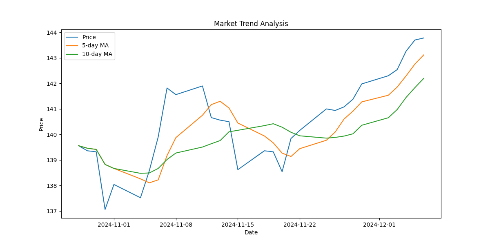
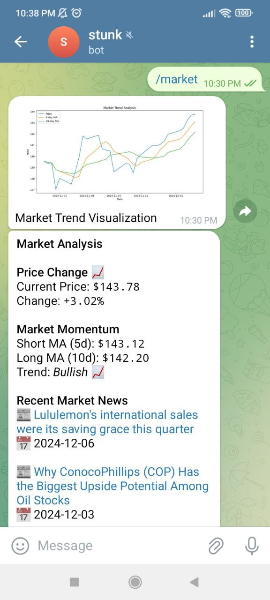
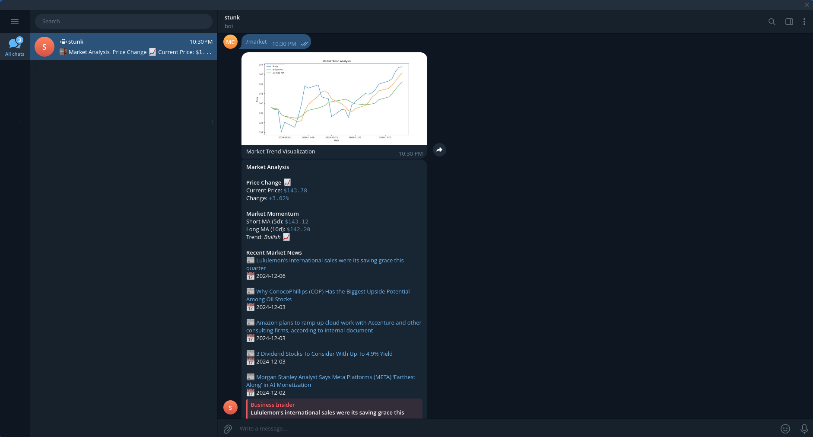

# stunk - Market Trend Analyzer

A Python tool that analyzes global market trends using the `VWRA.L` ETF (Vanguard FTSE All-World UCITS ETF) and provides relevant market news.

## Features

- Market trend analysis using price movement and moving averages
- Visual representation of market trends
- Relevant news articles based on market sentiment
- Configurable analysis parameters

## Screenshots



<div style="display: flex; align-items: flex-start;">
    
    
</div>

## Installation

1. Clone the repository
2. Install dependencies using Poetry:

```bash
poetry install
```

3. Start docker containers

```bash
docker-compose up -d # redis & postgres
```

4. Set up Telegram bot with BotFather - **OPTIONAL**

- Sign up with [BotFather](https://t.me/BotFather)
- Create a bot and get the token
- Send the bot a message and check for your chat ID in [getUpdates endpoint](https://api.telegram.org/bot{our_bot_token}/getUpdates)

5. Set up environment variables
   - `cp .env.example .env`
   - Sign up at [NewsAPI](https://newsapi.org) to get a free API key
   - Set `TELEGRAM_ALLOWED_CHAT_IDS` with the value of your chat ID (from step [4](#4-set-up-telegram-bot-with-botfather)) - **OPTIONAL**

## Usage

### Run the analysis

```bash
poetry run market_trend
```

The tool will:

1. Analyze the market trend using VWRA.L data
2. Generate a visualization
3. Display relevant market news
4. Save everything into the local `reports` directory

**_Generated Sample below_**

<details>
<summary><strong>📊 View Sample Generated Report</strong></summary>

**Market Analysis**

**Price Change** 📈

Current Price: `$143.78`

Change: `+3.02%`

**Market Momentum**

Short MA (5d): `$143.12`

Long MA (10d): `$142.20`

Trend: _Bullish 📈_

**Recent Market News**

📰 [Lululemon's international sales were its saving grace this quarter](https://www.businessinsider.com/lululemon-international-sales-china-q3-americas-flat-health-wellness-revenue-2024-12)

📅 2024-12-06

📰 [Why ConocoPhillips (COP) Has the Biggest Upside Potential Among Oil Stocks](https://finance.yahoo.com/news/why-conocophillips-cop-biggest-upside-143642930.html)

📅 2024-12-03

📰 [Amazon plans to ramp up cloud work with Accenture and other consulting firms, according to internal document](https://www.businessinsider.com/amazon-accenture-dxc-tata-consulting-firms-ramp-cloud-work-2024-12)

📅 2024-12-03

📰 [3 Dividend Stocks To Consider With Up To 4.9% Yield](https://finance.yahoo.com/news/3-dividend-stocks-consider-4-070431533.html)

📅 2024-12-03

📰 [Morgan Stanley Analyst Says Meta Platforms (META) ‘Farthest Along’ in AI Monetization](https://finance.yahoo.com/news/morgan-stanley-analyst-says-meta-174803364.html)

📅 2024-12-02


</details>

---

### Run the Telegram bot

```bash
poetry run telegram_bot
```

## Project Structure

- `stunk/`
  - `config.py`: Configuration settings
  - `market_trend.py`: Main entry point
  - `market_analyzer.py`: Market trend analysis logic
  - `visualizer.py`: Market visualization tools
  - `news_fetcher.py`: News fetching functionality
  - `utils.py`: Utility functions
  - `telegram_bot.py`: Telegram bot integration
  - `models.py`: Data Models and Utility classes
  - `storage/`
    - `init_db.py`: Database initialization script
    - `models.py`: Actual Database Models
    - `database.py`: SQLAlchemy session management
    - `cache.py`: Cache implementation
    - `connections.py`: Database & Cache connection management
  - `tests/`
    - `conftest.py`: Shared fixtures
    - `test_market_analyzer.py`: Tests for market trend analysis
    - `test_market_trend.py`: Tests for market trend generation
    - `test_news_fetcher.py`: Tests for news fetching
    - `test_telegram_bot.py`: Tests for Telegram bot
    - `test_visualizer.py`: Tests for market visualization

## Configuration

Adjust analysis parameters in `stunk/config.py`

- Analysis period
- Moving average periods
- Visualization settings
- News search queries

## Dependencies

### Core

- docker
- docker-compose
- python
- poetry
- postgres
- redis

### Libraries

- yfinance
- pandas
- matplotlib
- newsapi-python
- python-dotenv
- python-telegram-bot
- sqlalchemy
- redis
- psycopg2-binary
